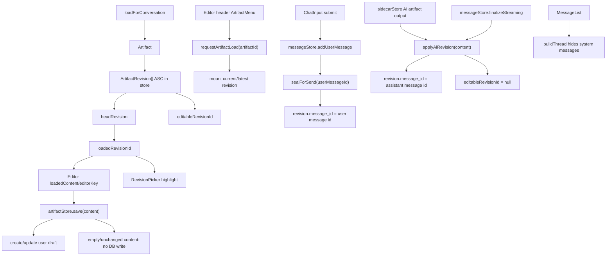

# Artifact Revisions

Artifact revision behavior is partly manual and more current than OpenSpec. Treat this file as source-of-truth context before changing revision code.

## Current Rules

- A revision is editable in-place only if `author === 'user'` and `message_id === null`.
- `loadedRevisionId` means the revision currently shown in the editor and highlighted in revision history.
- `editableRevisionId` means the revision safe to persist in place; `null` means the next save creates a user draft.
- `loadedContent` is the last persisted editor content baseline; `save(content)` returns without writing when `content === loadedContent`.
- Loading a historical revision keeps `loadedRevisionId` on that historical revision and sets `editableRevisionId` to `null`.
- Loading a sealed head revision also keeps it visible via `loadedRevisionId`, but sets `editableRevisionId` to `null`. Sealed user revisions and AI revisions must never be edited in place.
- `sealForSend()` sends the loaded historical revision when `editableRevisionId` is `null`, so chat submission follows the document the user opened rather than silently falling back to head.
- When an unchanged draft reuses the last sealed revision, `loadedRevisionId` moves to that sealed revision so revision history matches the content actually sent.
- `loadForConversation()` honors `conversations.active_artifact_id` before falling back to the newest artifact.
- Loading or creating a different artifact updates `conversations.active_artifact_id`.
- `requestArtifactLoad(artifactId)` loads that artifact, mounts its current revision if present, and falls back to an empty editor state for revisionless artifacts.
- The editor header `ArtifactMenu` lists all artifacts in the active conversation. Selecting an artifact opens that artifact at its current/latest revision.
- New empty artifacts stay revisionless until the editor saves non-empty changed content.
- Empty editor content and unchanged editor content do not create, update, or fork revisions.
- First non-empty changed editor save creates a draft only. It does not create chat-visible artifact cards or system messages.
- User revisions are sealed by linking `revision.message_id` to the persisted user message ID passed to `sealForSend(messageId)`.
- AI revisions are created as sealed revisions via `applyAiRevision(content, messageId)` and link `revision.message_id` to the assistant message ID.
- Background streaming persists AI revisions directly, then mirrors the persisted row into the open editor with `upsertStreamingAiRevision()`. That mirror updates `headRevision`, `loadedRevisionId`, and `loadedContent`, but leaves `editableRevisionId` as `null` because AI revisions are sealed.
- `Editor` must call `editor.setEditable(!isStreaming, false)`. TipTap can emit update events from editable-state changes; suppressing them prevents streamed AI content from being normalized and saved back as a duplicate user draft.
- Artifact revision system messages and `ArtifactRevisionCard` are removed from the visible chat flow.
- `buildThread()` filters all system messages out of chat rendering.

## Key Files

- `src/components/editor/artifactStore.ts`: lifecycle, save chain, seal chain, AI revisions, disk sync.
- `src/components/editor/Editor.tsx`: TipTap editor update sink; suppresses update emission while toggling read-only streaming state.
- `src/lib/revision-utils.ts`: pure helper logic and chat thread filtering.
- `src/components/chat/messageStore.ts`: user/assistant message creation and streaming state.
- `src/components/chat/chatSessionStore.ts`: coordinates user message creation, revision sealing, assistant streaming, and AI revision application.
- `src/components/editor/ArtifactMenu.tsx`: editor-header artifact popup for switching artifacts in the active conversation.
- `src/components/editor/RevisionPicker.tsx`: revision dropdown.
- `src/lib/db/repositories/revisions.ts`: revision persistence.
- `src/lib/db/repositories/documents.ts`: artifact listing/loading for the header artifact menu.

## Known Cleanup Opportunities

- `createRevision()` already updates artifact HEAD; some callers still call `updateArtifact(...current_revision_id...)` afterward.
- OpenSpec does not fully reflect the current `loadedRevisionId`/`editableRevisionId`/`editorKey` revision design.
