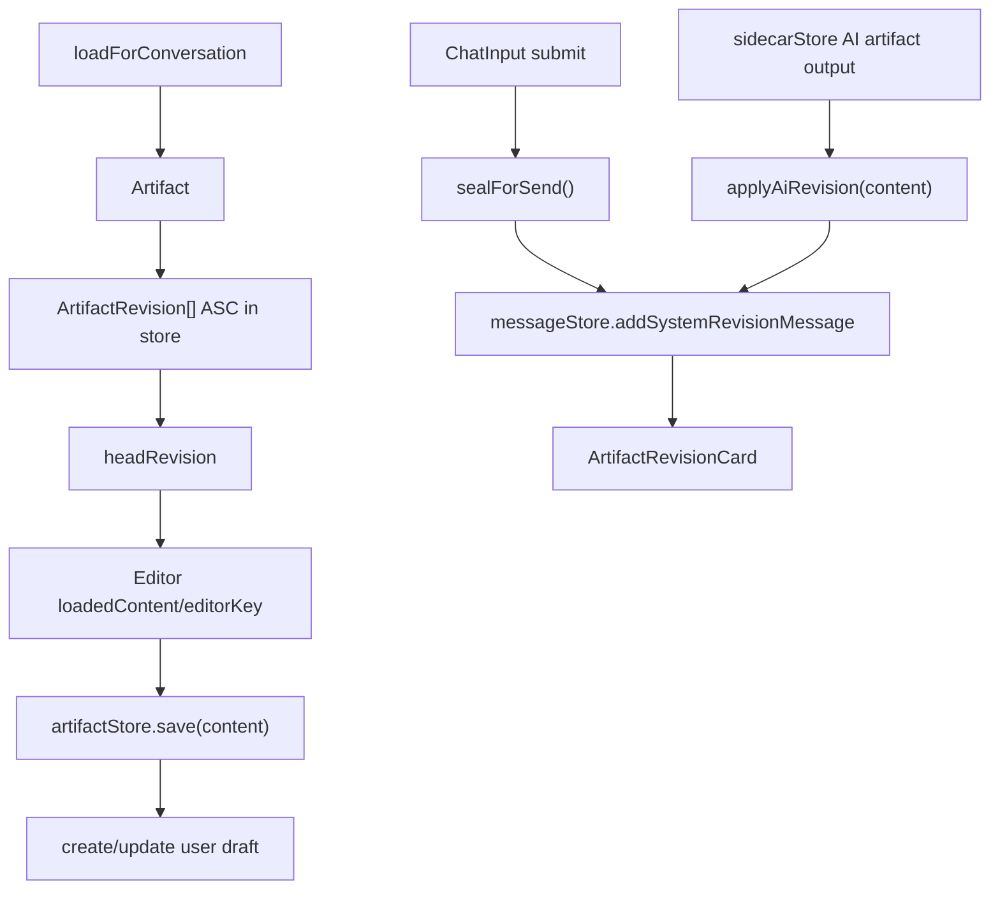

# Artifact Revisions

Artifact revision behavior is partly manual and more current than OpenSpec. Treat this file as source-of-truth context before changing revision code.

## Current Rules

- A revision is editable in-place only if `author === 'user'` and `message_id === null`.
- `activeRevisionId === null` means the editor is detached; next save creates a user draft.
- First editor save creates a draft only. It should not create a chat revision card until send/seal.
- System revision messages must include valid JSON metadata with `artifactId` and `revisionId`.
- `buildThread()` filters invalid system messages out of chat rendering.
- `ArtifactRevisionCard` should resolve via `artifactStore.getArtifactRevisionMeta(artifactId, { revisionId })` and render `null` if the artifact/revision is not loaded.
- AI revisions are created as sealed revisions via `applyAiRevision()`.

## Key Files

- `src/stores/artifactStore.ts`: lifecycle, save chain, seal chain, AI revisions, disk sync.
- `src/lib/revision-utils.ts`: pure helper logic and metadata parsing.
- `src/stores/messageStore.ts`: system revision message creation.
- `src/components/chat/ArtifactRevisionCard.tsx`: revision card UI/load action.
- `src/components/editor/RevisionPicker.tsx`: revision dropdown.
- `src/lib/db/repositories/revisions.ts`: revision persistence.

## Known Cleanup Opportunities

- `createRevision()` already updates artifact HEAD; some callers still call `updateArtifact(...current_revision_id...)` afterward.
- OpenSpec does not fully reflect the current `activeRevisionId`/`editorKey` revision design.
