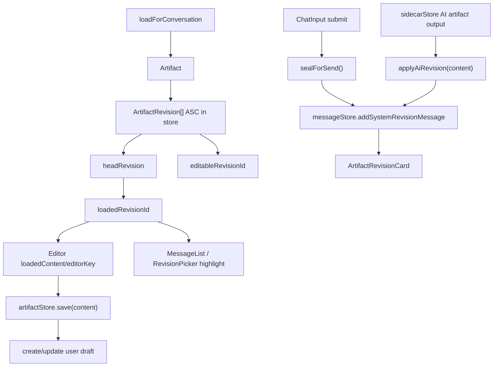

# Artifact Revisions

Artifact revision behavior is partly manual and more current than OpenSpec. Treat this file as source-of-truth context before changing revision code.

## Current Rules

- A revision is editable in-place only if `author === 'user'` and `message_id === null`.
- `loadedRevisionId` means the revision currently shown in the editor and highlighted in chat/history.
- `editableRevisionId` means the revision safe to persist in place; `null` means the next save creates a user draft.
- Loading a historical revision keeps `loadedRevisionId` on that historical revision and sets `editableRevisionId` to `null`.
- `sealForSend()` sends the loaded historical revision when `editableRevisionId` is `null`, so chat submission follows the document the user opened rather than silently falling back to head.
- When an unchanged draft reuses the last sealed revision, `loadedRevisionId` moves to that sealed revision so chat can highlight the card actually sent.
- `loadForConversation()` honors `conversations.active_artifact_id` before falling back to the newest artifact.
- Loading or creating a different artifact updates `conversations.active_artifact_id`.
- First editor save creates a draft only. It should not create a chat revision card until send/seal.
- System revision messages must include valid JSON metadata with `artifactId` and `revisionId`.
- `buildThread()` filters invalid system messages out of chat rendering.
- `ArtifactRevisionCard` should resolve via `artifactStore.getArtifactRevisionMeta(artifactId, { revisionId })`; if metadata is not loaded, it still renders with a safe fallback title so valid revision messages remain visible.
- AI revisions are created as sealed revisions via `applyAiRevision()`.

## Key Files

- `src/stores/artifactStore.ts`: lifecycle, save chain, seal chain, AI revisions, disk sync.
- `src/lib/revision-utils.ts`: pure helper logic and metadata parsing.
- `src/stores/messageStore.ts`: system revision message creation.
- `src/components/chat/ArtifactRevisionCard.tsx`: revision card UI/load action.
- `src/components/editor/RevisionPicker.tsx`: revision dropdown.
- `src/lib/db/repositories/revisions.ts`: revision persistence.

## Known Cleanup Opportunities

- `createRevision()` already updates artifact HEAD; some callers still call `updateArtifact(...current_revision_id...)` afterward.
- OpenSpec does not fully reflect the current `loadedRevisionId`/`editableRevisionId`/`editorKey` revision design.
