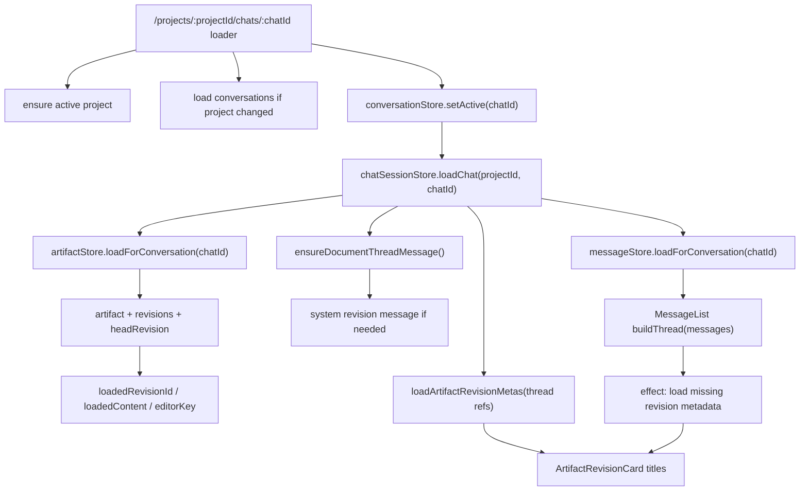

# Chat And Artifact Loading

At a glance:

## Trigger

- React Router route: `src/router.tsx`
- Path: `projects/:projectId/chats/:chatId`
- Loader runs before `ChatPage` renders.
- Loader side effects:
  - `projectStore.setActive(projectId)` if needed.
  - `conversationStore.loadForProject(projectId)` if conversations are stale.
  - `conversationStore.setActive(chatId)`.
  - `chatSessionStore.loadChat({ projectId, conversationId: chatId })`.

## Main Load Chain

`chatSessionStore.loadChat()`:

1. Sets chat session `status: "loading"`, active project, active conversation.
2. Calls `messageStore.loadForConversation(conversationId)`.
   - Clears old messages.
   - Reads `listMessages(conversationId)`.
   - Sets `messages` and `status: "ready"`.
3. Calls `artifactStore.loadForConversation(conversationId)`.
   - Resets artifact state.
   - Reads `listArtifacts(conversationId)` and `getConversation(conversationId)`.
   - Creates an artifact if none exists.
   - Chooses `conversation.active_artifact_id`, else newest artifact.
   - Reads `listRevisions(artifact.id)`.
   - Sets `artifact`, `headRevision`, `revisions`, and metadata cache.
   - Calls `_mountRevision(headRevision, true)` to set editor state.
4. Calls `artifactStore.ensureDocumentThreadMessage()`.
   - Creates an empty draft if the artifact has no head revision.
   - Ensures a system message anchors the document/revision in chat.
5. Calls `artifactStore.loadArtifactRevisionMetas(getThreadRevisionReferences())`.
   - Preloads all revision-card titles for the current thread.
   - Skips cached metadata.
6. Sets chat session `status: "ready"`.

## Editor State Side Effects

`artifactStore._mountRevision(revision, isHead)` sets:

- `loadedRevisionId`: revision currently shown in editor and highlighted in chat.
- `editableRevisionId`: same as loaded revision only when the head is an unsealed user draft (`author === "user"` and `message_id === null`); sealed user and AI heads stay loaded but detached from in-place editing.
- `loadedContent`: content passed into the editor.
- `editorKey`: remount key for fresh editor content.
- `status: "ready"`.

## Thread Metadata Updates

Two paths keep artifact card titles current:

- On chat load: `chatSessionStore.loadChat()` calls `loadArtifactRevisionMetas()`.
- While rendered: `MessageList` builds revision refs from `buildThread(messages)` and calls `loadArtifactRevisionMetas()` in an effect.

`ArtifactRevisionCard` renders title from:

`artifactStore.getArtifactRevisionMeta(artifactId, { revisionId })?.artifact.title ?? "Untitled"`

The lookup checks active editor state first, then the thread metadata cache.

## Debug Checkpoints

- Route not loading: inspect `src/router.tsx` chat loader.
- Empty thread: inspect `messageStore.loadForConversation()` and `listMessages()`.
- Editor shows wrong artifact: inspect `artifactStore.loadForConversation()` artifact selection and `conversations.active_artifact_id`.
- Wrong active card: inspect `loadedRevisionId`.
- Untitled revision cards: inspect `loadArtifactRevisionMetas()` cache and `ArtifactRevisionCard` lookup.
- Missing revision cards: inspect system message metadata and `parseRevisionMetadata()` / `buildThread()`.
