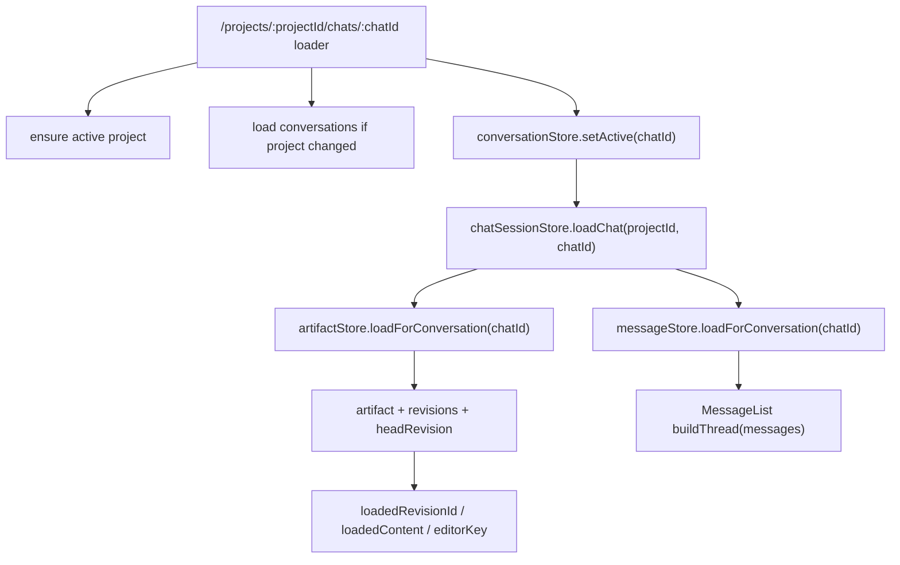

# Chat And Artifact Loading

At a glance:

## Trigger

- React Router route: `src/router.tsx`
- Path: `projects/:projectId/chats/:chatId`
- Loader runs before `ChatPage` renders.
- Loader side effects:
  - `projectStore.setActive(projectId)` if needed.
  - `conversationStore.loadForProject(projectId)` if conversations are stale.
  - `conversationStore.setActive(chatId)`.
  - `chatSessionStore.loadChat({ projectId, conversationId: chatId })`.

## Main Load Chain

`chatSessionStore.loadChat()`:

1. Sets chat session `status: "loading"`, active project, active conversation.
2. Calls `messageStore.loadForConversation(conversationId)`.
   - Clears old messages.
   - Reads `listMessages(conversationId)`.
   - Sets `messages` and `status: "ready"`.
3. Calls `artifactStore.loadForConversation(conversationId)`.
   - Resets artifact state.
   - Reads `listArtifacts(conversationId)` and `getConversation(conversationId)`.
   - Creates an artifact if none exists, but does not create a revision.
   - Chooses `conversation.active_artifact_id`, else newest artifact.
   - Reads `listRevisions(artifact.id)`.
   - Sets `artifact`, `headRevision`, `revisions`, and metadata cache.
   - Calls `_mountRevision(headRevision, true)` to set editor state.
4. Sets chat session `status: "ready"`.

Empty chats created from `CreateEmptyChatButton` load through the same route. They enter with no messages and `conversations.active_artifact_id === null`; the chat loader creates a revisionless artifact for the editor.

Project-page task submissions do not use route state. `NewTaskInput` creates the conversation, starts `backgroundGenerationStore.startMessage({ artifactContext: null })`, and only then navigates to the chat route, where `messageStore.loadForConversation()` reads the already-created user/assistant rows.

## Editor State Side Effects

`artifactStore._mountRevision(revision, isHead)` sets:

- `loadedRevisionId`: revision currently shown in editor and highlighted in chat.
- `editableRevisionId`: same as loaded revision only when the head is an unsealed user draft (`author === "user"` and `message_id === null`); sealed user and AI heads stay loaded but detached from in-place editing.
- `loadedContent`: content passed into the editor.
- `editorKey`: remount key for fresh editor content.
- `status: "ready"`.

## Debug Checkpoints

- Route not loading: inspect `src/router.tsx` chat loader.
- Empty thread: inspect `messageStore.loadForConversation()` and `listMessages()`.
- Editor shows wrong artifact: inspect `artifactStore.loadForConversation()` artifact selection and `conversations.active_artifact_id`.
- Wrong active card: inspect `loadedRevisionId`.
- Missing generation progress after project-page task submit: inspect `backgroundGenerationStore.activeJobs`, the assistant message `metadata.stream`, and whether `NewTaskInput` called `startMessage()` before navigation.
