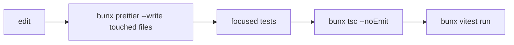

# Development Rules

Use these constraints when coding in this repo.

## Commands

- Use Bun only for JS/TS: `bun`, `bunx`; never `npm`.
- Common checks:
  - `bunx tsc --noEmit`
  - `bunx vitest run`
  - `bunx prettier --write <files>`
- App commands:
  - `bun run dev`
  - `bun run build`
  - `bun run tauri`
  - `bun run db:generate`
  - `bun run db:migrate`
- Python: use `uv`/`uvx`; never `pip`.

## Exploration

- Use Serena MCP first for TypeScript/Python symbol search, references, and refactors.
- Context7 is requested by project instructions for library docs, but no Context7 MCP was available in this session.
- Prefer targeted symbol reads and pattern searches; do not load huge spec files wholesale.

## Verification Checklist

## Git Hygiene

- Existing worktree may be dirty.
- Do not revert user changes.
- Current untracked `.codex/` existed before memory capture and should be ignored unless explicitly requested.
