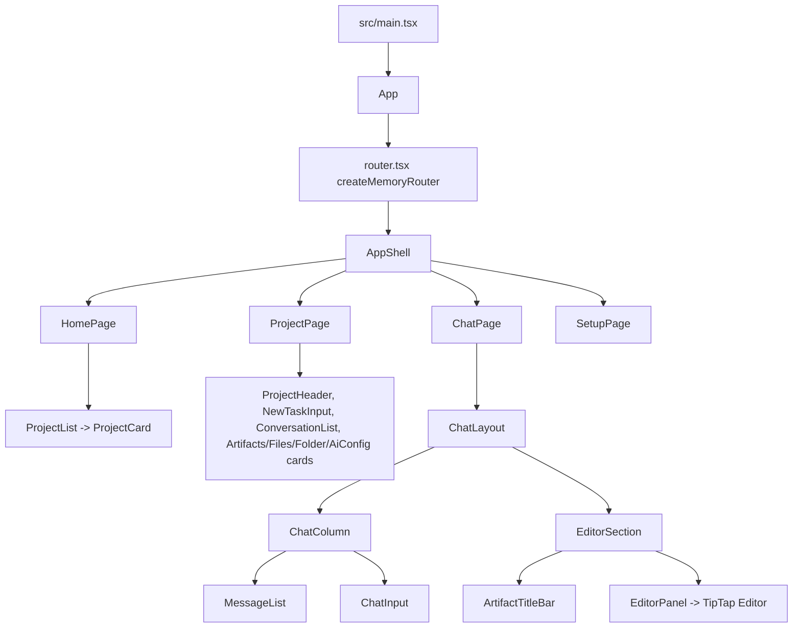
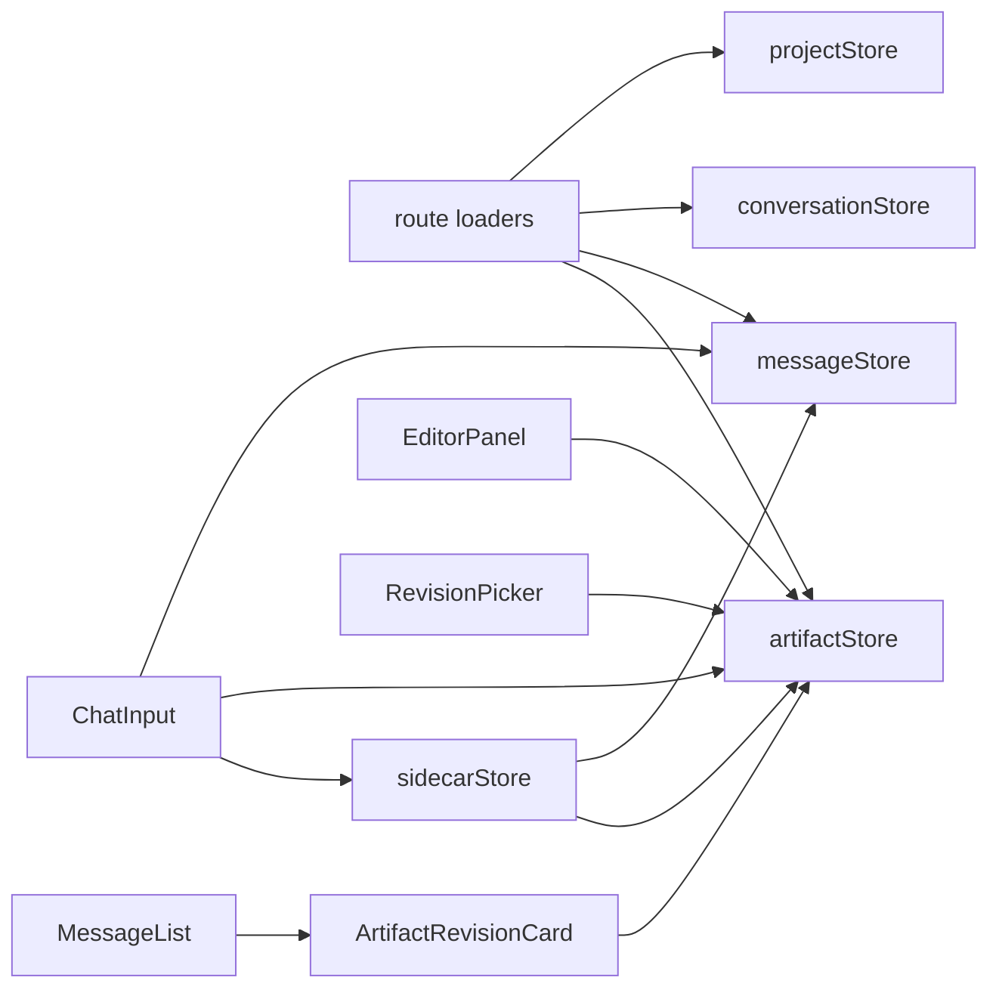

# Frontend Relations

Pages are thin; feature components and Zustand stores own behavior. Route loaders load active project/conversation state and start message/artifact loading for chat independently.

## Store Map

## Page Dependency Map

See `.memory/page-dependencies.md` for the page-by-page component/store/dependency map. Main drivers:

- `AppShell`: `appStore` plus router navigation state.
- `HomePage`: `ProjectList` over `projectStore`.
- `ProjectPage`: `projectStore`, `conversationStore`, project settings, provider/model stores, and artifact preview repositories.
- `ChatPage`: `conversationStore`, `messageStore`, `artifactStore`, and `sidecarStore`.
- `SetupPage`: setup wizard over app/provider/settings state.

## Chat and Artifact Coupling

- There is no separate `ChatStore`; chat state is `messageStore` plus `sidecarStore`.
- `artifactStore.loadedRevisionId` is the revision currently open in the editor and highlighted in chat/history.
- `artifactStore.editableRevisionId` is the revision that can be saved in place; `null` means the next save creates a user draft.
- Both `ArtifactRevisionCard` and `RevisionPicker` select revisions through `artifactStore.requestRevisionLoad(revisionId)`.
- `artifactStore.loadForConversation()` honors `conversations.active_artifact_id` before falling back to the most recently updated artifact.

## Component Rules

- Prefer `src/components/ui/*` shadcn/Base UI primitives.
- Use Tailwind design tokens; do not hard-code colors.
- Keep components small and functional.
- Stores/loaders are preferred places for app side effects, though current code still has some component effects.
- Icons are mixed between lucide and Phosphor; prefer lucide for new button/icon UI unless matching nearby code.
