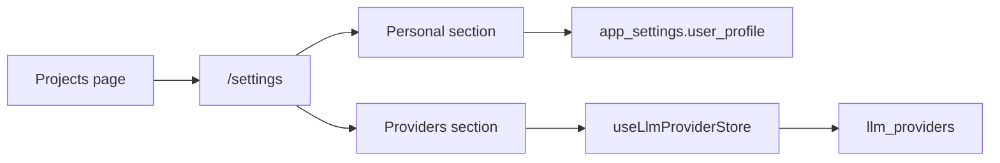
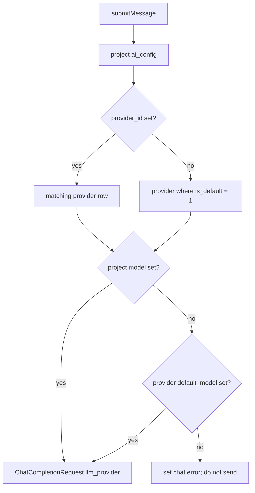
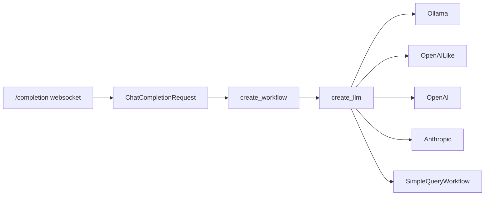

# Provider Setup And Usage

## Purpose

Providers are global LLM connection records. Projects choose a provider/model through project AI config; chat requests resolve that choice and send a concrete `llm_provider` payload to the Python sidecar.

## Storage Pattern

Provider rows live in `llm_providers`:

- `provider_type`: one of `ollama`, `openai_like`, `openai`, `anthropic`
- `base_url`, `api_key`: runtime connection values
- `default_model`: fallback model when a project has no model selection
- `config_json`: JSON object for provider-specific constructor options
- `is_default`: global fallback provider

Project model choice stays in `app_settings` as `project:${projectId}:ai_config`:

```ts
{
  provider_id: string | null
  model: string | null
  embedding_model: string | null
}
```

Because `llm_providers` is part of the single dev migration, schema changes require deleting/reinitializing the local SQLite DB.

## Setup/UI Pattern



Use these components/patterns:

- `ProfileForm` is the shared profile writer for setup and settings.
- `ProviderStep` creates the first default provider during onboarding.
- `ProvidersSettingsSection` handles provider CRUD, default selection, default model, and constructor config.
- `useLlmProviderStore` owns provider loading and mutations: `loadAll`, `createProvider`, `updateProvider`, `deleteProvider`, `setDefaultProvider`, `fetchModels`.

## Chat Resolution

`chatSessionStore.ts` resolves provider settings before websocket send:



Resolution rules:

- Provider: project `provider_id` first, then global default provider.
- Model: project `model` first, then provider `default_model`.
- Missing provider or model blocks send and sets a chat error.
- The sidecar receives snake_case `llm_provider` as part of `ChatCompletionRequest`.

## Sidecar Constructor Map

`schemas.py` validates `LlmProviderSettings`; `routers/completion.py` passes it to `create_workflow`; `llamaflows/llm_factory.py` builds the LlamaIndex LLM.



Constructor mapping:

| `provider_type` | Import | Key settings |
| --- | --- | --- |
| `ollama` | `from llama_index.llms.ollama import Ollama` | `model`, `base_url`, `temperature`, `context_window`, `request_timeout`, `is_function_calling_model`, `thinking` |
| `openai_like` | `from llama_index.llms.openai_like import OpenAILike` | `model`, `api_base`, `api_key`, `context_window`, `is_chat_model`, `is_function_calling_model`, `temperature`, `max_tokens`, `timeout` |
| `openai` | `from llama_index.llms.openai import OpenAI` | `model`, `api_key`, `api_base`, `temperature`, `max_tokens`, `timeout`, `max_retries`, `reasoning_effort` |
| `anthropic` | `from llama_index.llms.anthropic import Anthropic` | `model`, `api_key`, `base_url`, `temperature`, `max_tokens`, `timeout`, `max_retries`, `thinking_dict` |

## Request Shape

Frontend sends:

```ts
{
  message,
  chat_history,
  artifact,
  llm_provider: {
    provider_id,
    provider_type,
    name,
    base_url,
    api_key,
    model,
    temperature,
    max_tokens,
    timeout,
    context_window,
    is_chat_model,
    is_function_calling_model,
    thinking,
    reasoning_effort,
    config,
  },
}
```

After changing `src-python/schemas.py`, regenerate `src/lib/api-types.ts` with:

```bash
uv run --python ./src-python/.venv/bin/python python src-python/generate_types.py --method jsonschema --output src/lib/api-types.ts
```

After changing `src-tauri/migrations/001_initial.sql`, regenerate/check DB types with:

```bash
bun run db:generate
bun run db:check
```

## Tests To Keep Current

- Frontend request resolution: `src/components/chat/__tests__/chatSessionStore.test.ts`
- Provider store CRUD/model fetch: `src/components/projects/__tests__/llmProviderStore.test.ts`
- Provider SQL columns: `src/lib/db/__tests__/repositories/llm-providers.test.ts`
- Settings shell: `src/pages/__tests__/SettingsPage.test.tsx`
- Sidecar constructor map: `src-python/tests/test_llm_factory.py`
