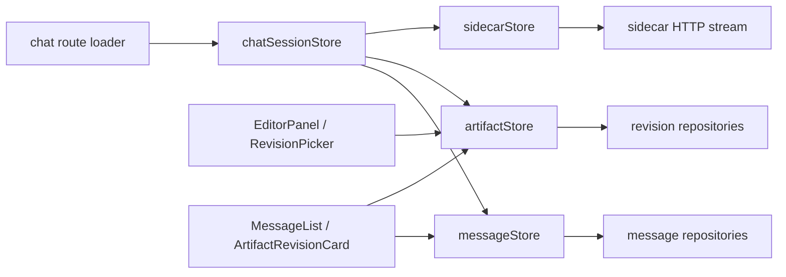

# React Persistent Store Refactor

Date: 2026-05-16

## Summary

Zustand stores were moved out of the global `src/stores` folder and colocated with their consuming feature areas. Chat now has an explicit page-level orchestration store, `chatSessionStore`, so artifact, message, and sidecar stores no longer communicate through hidden imports.

## Store Locations

- `src/app/appStore.ts`: root app boot/setup state.
- `src/components/chat/messageStore.ts`: messages and assistant streaming buffer.
- `src/components/chat/sidecarStore.ts`: sidecar transport only.
- `src/components/chat/chatSessionStore.ts`: chat route orchestration.
- `src/components/editor/artifactStore.ts`: active artifact, revisions, save/seal lifecycle.
- `src/components/conversations/conversationStore.ts`: project conversation list and active conversation.
- `src/components/projects/projectStore.ts`: projects.
- `src/components/projects/projectSettingsStore.ts`: per-project AI config.
- `src/components/projects/llmProviderStore.ts`: providers and model discovery.
- `src/components/ui/notificationStore.ts`: toast notification queue.

## Relationship Map

## Answers From Investigation

- `EditorPanel` can render independently, but it needs `artifactStore.loadForConversation()` or equivalent hydration before it can edit a real artifact. Without that, it shows the empty/no-artifact state and `save()` guards prevent writes.
- The previous direct `EditorPanel -> messageStore.isStreaming` dependency was unnecessary. It now reads page-level streaming state from `chatSessionStore`, so standalone editor usage is not tied to loaded message state.
- `ChatInput` previously depended on `messageStore`, `artifactStore`, and `sidecarStore` directly. That could fail if artifact sealing tried to create a system revision message before `messageStore.conversationId` was loaded.
- `MessageList` and `ArtifactRevisionCard` can render without matching artifact state, but titles and active revision highlighting degrade because they depend on the currently loaded artifact/revision.

## Final Decisions

- Keep domain stores small and focused; do not duplicate messages or revisions in the page store.
- Use `chatSessionStore` for explicit chat flow coordination: load chat context, submit user messages, seal artifact context, stream sidecar output, finalize assistant messages, and apply AI artifact revisions.
- `artifactStore` receives an explicit `ensureRevisionMessage` callback when a revision needs a chat anchor. It no longer imports `messageStore`.
- `sidecarStore` accepts a prepared request plus stream callbacks and returns the final stream result. It no longer imports `messageStore`, `artifactStore`, or message repositories.
- Debug labels added for important stages: `APP_STORE`, `CHAT_SESSION`, `MESSAGE_STORE`, `ARTIFACT_STORE`, and `SIDECAR_STORE`.

## Verification

- `bunx tsc --noEmit`
- `bunx vitest run src/components/editor/__tests__/artifactStore.test.ts src/components/chat/__tests__/messageStore.test.ts src/components/chat/__tests__/chatSessionStore.test.ts`
- `bunx vitest run src/components/chat/__tests__/ArtifactRevisionCard.test.tsx src/components/chat/__tests__/MessageList.test.tsx src/components/editor/__tests__/RevisionPicker.test.tsx`
